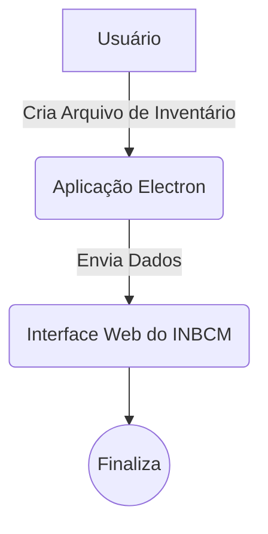

# Cliente Offline - Aplicação Electron

### Criação e Envio de Arquivos via Interface Web

A aplicação Electron servirá como um cliente offline, permitindo aos usuários criar arquivos de inventário de forma offline e enviá-los posteriormente por meio da interface web do INBCM.

**Solução de Desenvolvimento:**

Desenvolver uma aplicação Electron autônoma que ofereça funcionalidades offline para a criação de arquivos de inventário. Integrar a aplicação à interface web do INBCM para envio eficiente dos dados, proporcionando assim o funcionamento remoto desejado.