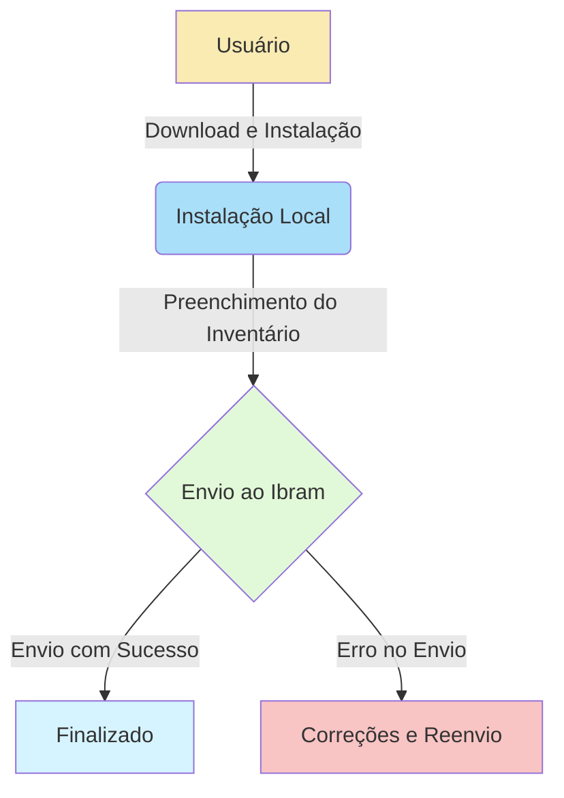
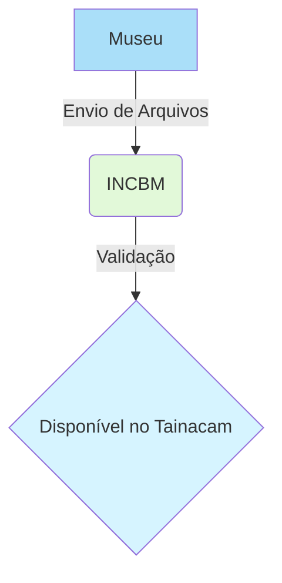
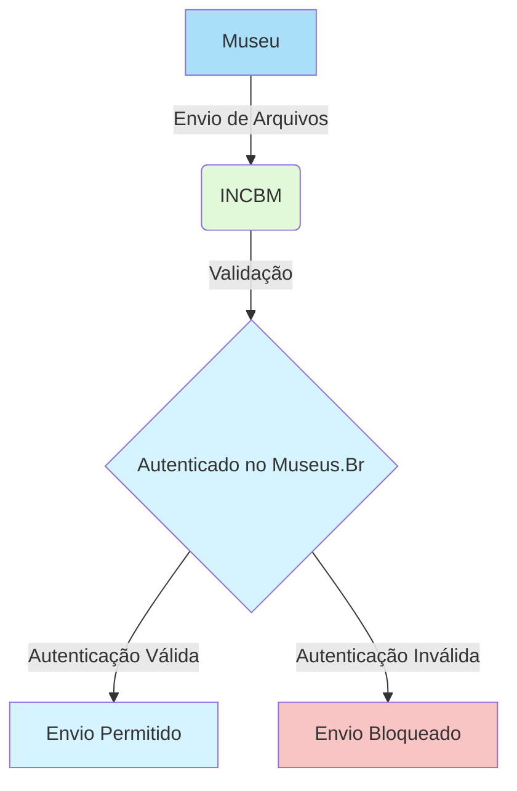
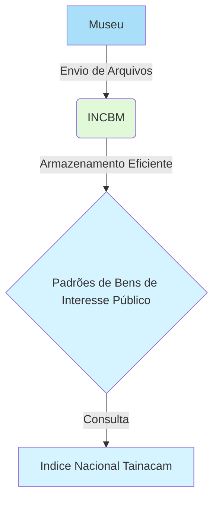
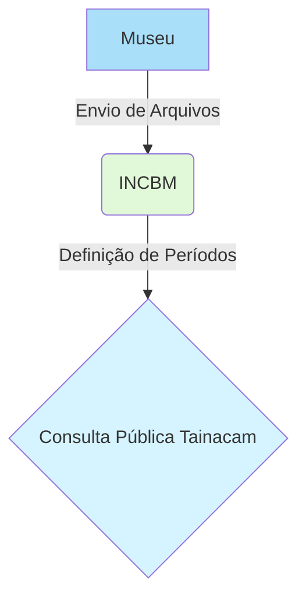
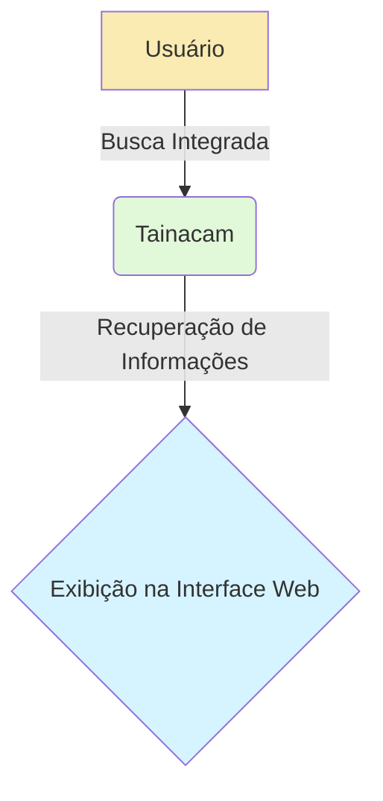
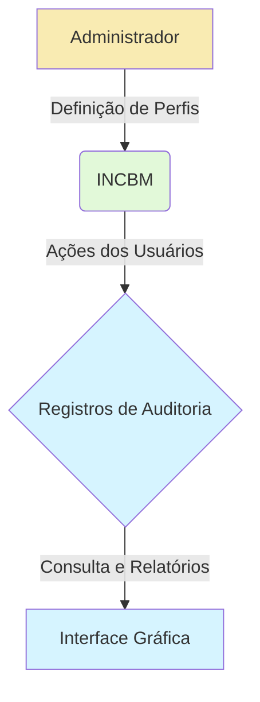
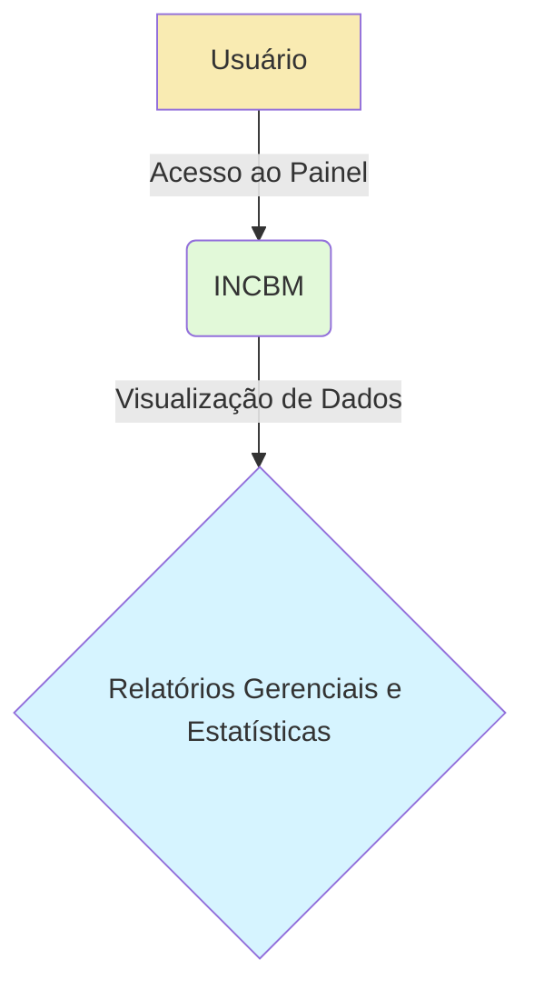
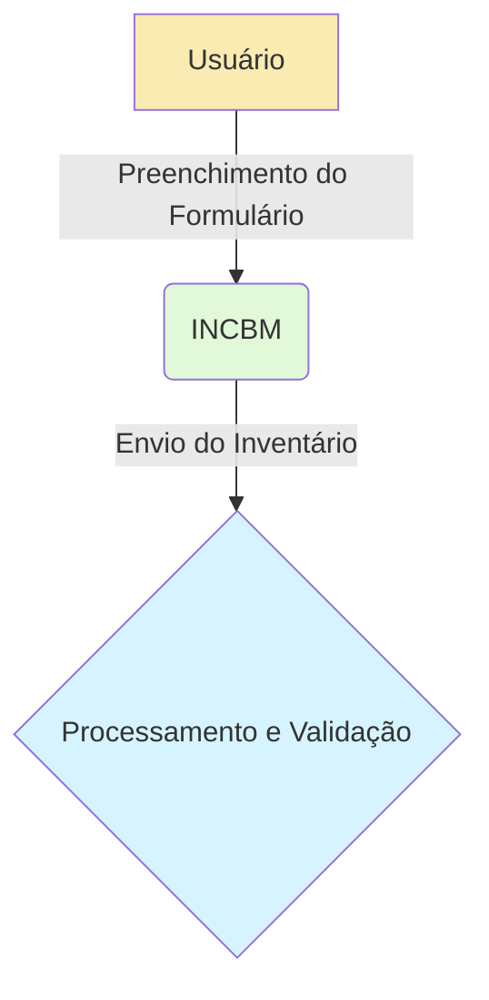

# INCBM - Extensão do Plugin Tainacam

O INCBM será uma extensão do plugin Tainacam, ampliando suas funcionalidades para permitir o recebimento, validação e indexação de arquivos de inventário. Essa extensão será executada exclusivamente no site do Ibram, garantindo um ambiente controlado para o processamento das informações.

## Funcionamento Remoto e Interface Web

O INCBM, implementado como uma extensão do plugin Tainacam no WordPress, disponibilizará uma API para funcionalidades remotas. Isso permitirá aos usuários realizar o download da extensão e a instalação local. A interface web integrada ao plugin facilitará o preenchimento do inventário, seja em modo rascunho ou para o envio final das informações ao Ibram.

**Solução de Desenvolvimento:**

Desenvolver o INCBM como uma extensão do plugin Tainacam no WordPress, incluindo uma interface web para o preenchimento do inventário e uma API para interação remota, garantindo uma experiência completa aos usuários durante o processo de inventário.

## Importação e Validação de Informações

O INCBM, como extensão do Tainacam, facilitará a importação e validação de dados e imagens nos formatos Xls, CSV ou Xml. Após validação, os dados serão disponibilizados para consulta no índice nacional através do Tainacam.

**Solução de Desenvolvimento:**

Implementar funcionalidades de importação e validação na extensão INCBM do plugin Tainacam. Isso garantirá a compatibilidade com os formatos especificados e permitirá que os dados importados, após validação, sejam disponibilizados no índice nacional através do Tainacam.

## Integração com Registro de Museus e Autenticação

A integração com o registro de museus (Museus.Br) será uma forma de autenticar o envio, permitindo que apenas museus devidamente cadastrados possam utilizar as interfaces de envio de arquivos.

**Solução de Desenvolvimento:**

Integrar o INCBM ao registro de museus (Museus.Br) por meio da extensão Tainacam, utilizando um sistema de autenticação que valide o museu no momento do envio. A autenticação será realizada por meio do número de registro (login e senha na plataforma Museus.Br), garantindo que apenas instituições cadastradas possam enviar informações.

## Armazenamento e Gestão de Dados

A extensão INCBM do plugin Tainacam terá capacidade de armazenamento eficiente para dados e imagens, seguindo padrões para bens de interesse público.

**Solução de Desenvolvimento:**

Desenvolver uma solução robusta de armazenamento dentro da extensão INCBM, integrada ao Tainacam. Seguir padrões e procedimentos de gestão para garantir a eficiência no armazenamento.

**Referências:**  
- [Padrão de arquivo de inventário](../padroes/arquivos.md)  
- [Padrão de imagens](../padroes/imagens.md)  
- [Manutenção de imagens](../processos/manutencao-imagens.md)

## Períodos de Lançamento e Consulta ao Cidadão

O INCBM, como parte do Tainacam, permitirá a definição de períodos para o recebimento e reenvio de informações, além de disponibilizar uma interface de consulta pública, tornando os dados acessíveis aos cidadãos brasileiros.

**Solução de Desenvolvimento:**

Incorporar à extensão INCBM do plugin Tainacam a capacidade de definir períodos para o recebimento e reenvio de informações. Implementar uma interface de consulta pública para acesso transparente aos dados.

## Busca Integrada e Recuperação de Informações

A extensão INCBM do Tainacam realizará buscas integradas em diferentes tipologias de acervo, facilitando a recuperação eficiente de informações.

**Solução de Desenvolvimento:**

Desenvolver funcionalidades de busca integrada na extensão INCBM do Tainacam, permitindo a recuperação eficiente de informações entre as tipologias de acervo e a exibição dos dados por meio da interface web do Tainacam.

## Perfis de Acesso e Auditoria

O INCBM, como extensão do Tainacam, terá funcionalidades para definir perfis de acesso, possibilitando uma administração eficaz, e registrará ações dos usuários para auditoria, incluindo uma interface gráfica para consulta e geração de relatórios gerenciais.

**Solução de Desenvolvimento:**

Implementar funcionalidades de perfis de acesso na extensão INCBM do plugin Tainacam. Registrar ações dos usuários para auditoria e criar uma interface gráfica para consulta e geração de relatórios gerenciais.

## Painel de Relatórios

O painel de relatórios será integrado à extensão INCBM do plugin Tainacam, oferecendo uma visão consolidada e detalhada das atividades relacionadas ao inventário de bens culturais musealizados.

**Dados de Acompanhamento**  
O painel fornecerá estatísticas e métricas relacionadas aos envios de inventários, incluindo o número de envios por período, museu, e tipologia de acervo. Isso possibilitará uma visão geral do volume de informações processadas.

**Quantificação dos Elementos de Acervo**  
Os relatórios incluirão dados quantitativos sobre os elementos de acervo declarados, segmentados por tipologia, estado de conservação e outras características relevantes. Isso permitirá análises mais detalhadas sobre a composição do acervo musealizado.

**Personalização de Relatórios**  
Os usuários terão a capacidade de personalizar relatórios de acordo com suas necessidades específicas, escolhendo os parâmetros relevantes para análise. Isso garantirá flexibilidade na extração de informações específicas.

**Acompanhamento em Tempo Real**  
O painel de relatórios será atualizado em tempo real, proporcionando uma visão dinâmica das atividades de inventário. Os usuários poderão monitorar o progresso e identificar áreas que requerem atenção imediata.

**Solução de Desenvolvimento:**

Integrar ao INCBM uma funcionalidade avançada de painel de relatórios, utilizando gráficos interativos e tabelas dinâmicas para apresentação dos dados. Implementar algoritmos de análise para quantificação de elementos de acervo, oferecendo uma visão detalhada e personalizável para os usuários. Assegurar que o painel seja atualizado em tempo real para fornecer informações precisas e oportunas.

## Formulário Online para Recebimento de Dados

O INCBM, como plugin WordPress, oferecerá aos usuários a funcionalidade de acessar um formulário online para o recebimento de dados do inventário. Este formulário será integrado à interface web do INCBM e permitirá aos usuários preencherem as informações necessárias sobre os elementos do acervo, seguindo as categorias de bens culturais musealizados.

**Benefícios:**

1. **Acessibilidade Remota:** O formulário online possibilita que os usuários preencham os dados do inventário de forma remota, proporcionando flexibilidade de acesso.

2. **Validação em Tempo Real:** O INCBM realizará validações em tempo real durante o preenchimento, garantindo a conformidade com os requisitos estabelecidos pelo Ibram.

3. **Facilidade de Envio:** Após o preenchimento, os usuários poderão enviar os dados diretamente por meio da interface web do INCBM, simplificando o processo de declaração de inventário.

**Solução de Desenvolvimento:**

Implementar um formulário online integrado à interface web do INCBM, utilizando tecnologias web modernas para garantir uma experiência de usuário intuitiva. O formulário será projetado para orientar os usuários na inserção correta de informações, enquanto validações em tempo real serão aplicadas para assegurar a precisão dos dados. Isso contribuirá para um processo eficiente de recebimento de dados do inventário musealizado.