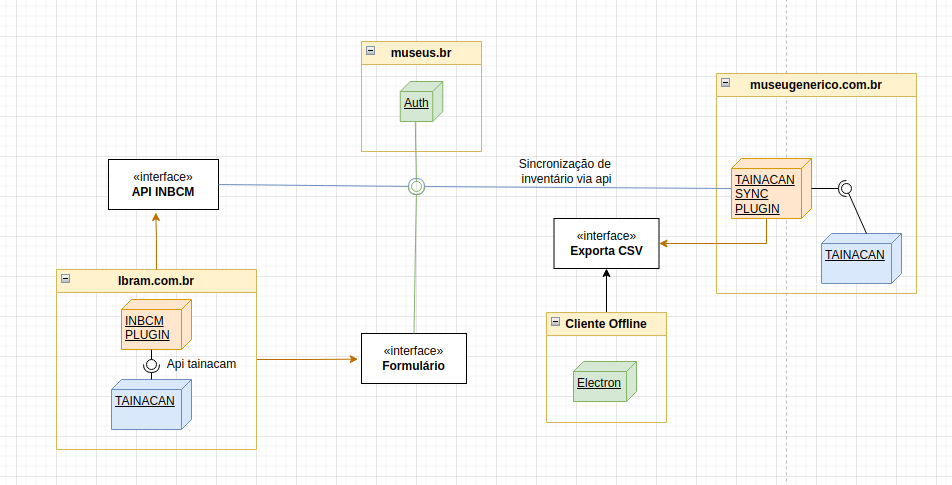

# Inventário Nacional de Bens Culturais Musealizados

Bem vindo à documentação técnica do INBCM, este repositório visa concentrar e padronizar todos
os documentos de desenvolvimento do ecossistema INBCM.

## Antes de começar

Este site contém a documentação e especificação técnica dos sistemas, voltado para os desenvolvedores INCBM, utilizará referências em linguagem de programação e referências UML, os termos e nomenclaturas museológicos poderão ser substituídos por termos técnicos voltados para programadores de forma que a tradução destes elementos se torne mais fácil para as equipes de desenvolvimento.

## O que é o INCBM?
A Resolução Normativa Ibram nº 6, de 31 de agosto de 2021, normatiza o Inventário Nacional dos Bens Culturais Musealizados (INBCM) em concordância com o Decreto nº 8.124, de 17 de outubro de 2013. O INBCM é um instrumento para inserção periódica de dados sobre os bens culturais musealizados em acervos museológico, bibliográfico e arquivístico dos museus brasileiros. A Resolução estabelece elementos de descrição para identificação desses bens, abrangendo categorias como museológicos, bibliográficos e arquivísticos. Além disso, define etapas para implementação do INBCM, como a definição de elementos de descrição, publicação de recomendações técnicas e orientações para envio e consulta das informações. A Resolução revoga normativas anteriores e entrou em vigor em 1º de outubro de 2021.

Mais informações na [Resolução Normativa Ibram nº 6](https://www.gov.br/museus/pt-br/assuntos/legislacao-e-normas/outros-instrumentos-normativo/resolucao-normativa-ibram-no-6-de-31-de-agosto-de-2021).

## Visão geral do ecossistema
O ecossistema do INCBM é composto de múltiplas aplicações que trabalham em conjunto, a interação desses sistemas visa oferecer aos museus uma forma de enviar os inventários para o cadastro nacional de forma organizada e fácilmente compreensível pelo usuário final por diferentes canais.

*Acima: Visualiação da implantação do INCBM*

Os elementos neste diagrama exemplificam a implementação do ecossistema contendo:

* `Plugin INCBM` - Plugin responsável pelo recebimento e tratamento dos inventários.
* `Plugin Tainacan Sync` - Plugin responsável pela exportação e/ou sincronização de dados entre as instalações do tainacam com o inventário nacional.
* `Cliente Offline` - Um sistema standalone que permite a criação do arquivo de inventário sem necessidade de conexão com a internet ou instalação local do tainacam.

## Os componentes

### Plugin INCBM
O plugin INCBM é o grande centralizador de dados, projetado para recepcionar e validar os arquivos de invetário dos museus, funciona como uma extensão do Tainacam consumindo suas apis ([hooks](https://tainacan.github.io/tainacan-wiki/#/dev/hooks), [api interna](https://tainacan.github.io/tainacan-wiki/#/dev/internal-api) e [api json](https://redocly.github.io/redoc/?url=https://github.com/tainacan/tainacan-wiki/raw/master/dev/openapi.json)) o INCBM adicionará novas funcionalidades.

### Plugin Tainacam Sync
Este plugin, também uma extensão para o Tainacam, será utilizado por usuários de museus que já tem o tainacam instalado para fornecer um guia e interface de exportação de dados direto no painel wordpress.

### Cliente Offline
O cliente offline é uma aplicação Electron utilizada para criar o arquivo de inventário para os museus que não utilizam o tainacam e/ou não possuem qualidade ou disponibilidade de conexão com o inventário. Esta aplicação fornece formulários para a criação do inventários, gestão dos itens do inventário e exportação do arquivo de inventário para envio através de um formulário. 

## Defesa desta solução

A decisão de dividir a solução em três sistemas independentes, Plugin INCBM, Plugin Tainacam Sync e Cliente Offline, é estrategicamente fundamentada em várias considerações, abordando temas críticos como segurança, facilidade de acesso e manutenção.

### 1. **Segurança**  

**Plugin INCBM:** Ao centralizar a validação e recebimento de arquivos, o Plugin INCBM pode ser projetado com uma camada de segurança robusta, implementando autenticação forte e validação rigorosa para garantir a integridade dos dados recebidos. Além disso, a integração com as APIs do Tainacam permite uma comunicação segura entre os sistemas.

**Plugin Tainacam Sync:** Como uma extensão do Tainacam, este plugin aproveita a segurança já implementada no Tainacam. A autenticação pelo Museus.br reforça a segurança durante a exportação de dados, garantindo que apenas usuários autorizados possam realizar operações.

**Cliente Offline:** Ao permitir que museus usem um cliente offline, garantimos que instituições com diferentes níveis de conectividade ou preferências de sistema possam participar do processo de inventário. O Cliente Offline gera um arquivo zip seguro, incorporando checksums para validação e garantindo a integridade dos dados durante o envio.

### 2. **Facilidade de Acesso**
**Plugin INCBM:** O Plugin INCBM oferece uma solução baseada na web e, como um plugin WordPress, é facilmente acessível para usuários autorizados. A interface web simplificada facilita o preenchimento do inventário, garantindo uma experiência amigável.

**Plugin Tainacam Sync:** Integrado ao painel WordPress, este plugin fornece uma interface familiar para usuários do Tainacam, simplificando o processo de exportação de dados. A facilidade de acesso é vital para incentivar a participação e garantir uma transição suave para novos recursos.

**Cliente Offline:** A aplicação Electron proporciona uma solução amigável para usuários que preferem uma ferramenta offline. Com formulários intuitivos e uma interface de usuário simples, o Cliente Offline oferece uma experiência descomplicada para criação e gestão de inventários.

### 3. **Manutenção**
**Plugin INCBM e Plugin Tainacam Sync:** Dividir as funcionalidades entre o Plugin INCBM e o Plugin Tainacam Sync facilita a manutenção e atualizações independentes. Isso permite a evolução contínua de cada componente sem afetar diretamente o funcionamento do outro.

**Cliente Offline:** Como uma aplicação independente, o Cliente Offline também pode ser atualizado de forma independente, garantindo flexibilidade e facilitando a manutenção contínua.
