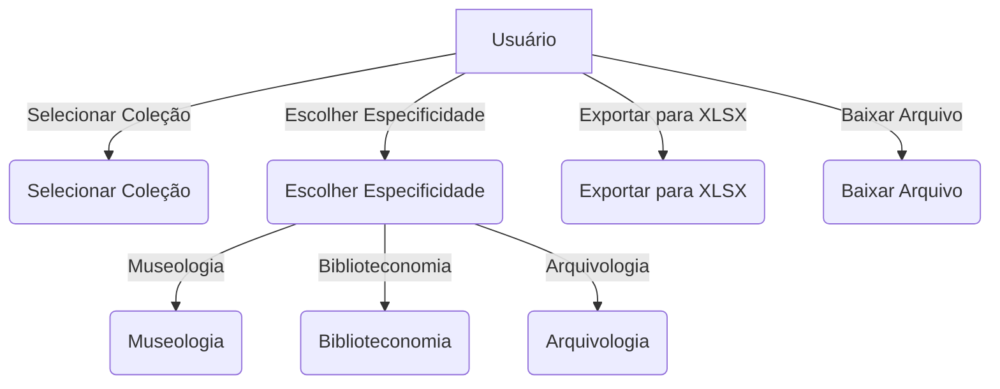

### Caso de uso

Visando a simplicidade de uso do plugin os padrões de usabilidade seguem as especificações do Tainacan, inserindo uma nova opção de exportador no menu tainacan. As funcionalidades do plugin podem ser ilustradas de acordo com o diagrama abaixo:

