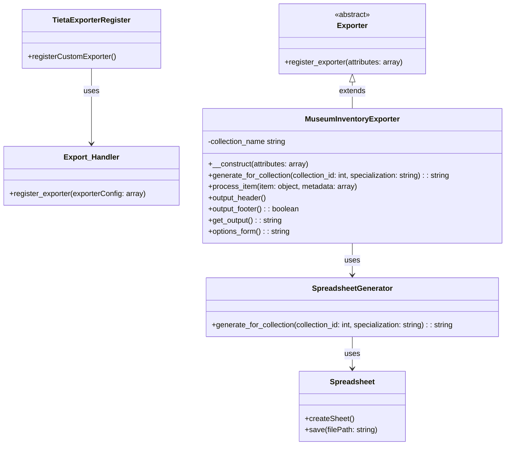

# Diagrama de classes

O diagrama de classes apresentado descreve a estrutura e as relações entre as classes dentro do plugin, focando na exportação de inventários de museus.

- **Exporter**: Uma classe abstrata (assumida como parte do núcleo do Tainacan) que a sua classe `MuseumInventoryExporter` estende. Provavelmente contém funcionalidades comuns para exportadores, como a base para a implementação de métodos específicos de exportação.

- **Export_Handler**: Essa classe é utilizada pelo `TietaExporterRegister` para registrar o exportador personalizado. É uma representação simplificada, assumindo que o Tainacan fornece tal manipulador para gerenciar diferentes exportadores.

- **Spreadsheet**: Representa as funcionalidades utilizadas pelo `SpreadsheetGenerator` para criar e salvar planilhas, conceptualizando o uso da biblioteca PhpSpreadsheet ou similar. Esta classe simboliza as ações de criação da planilha Excel e seu salvamento.

- **TietaExporterRegister**: Gerencia o registro do exportador personalizado dentro do framework do Tainacan. Este componente é responsável por inicializar o processo de registro do exportador customizado para que ele seja reconhecido pelo Tainacan.

- **MuseumInventoryExporter**: Implementação customizada de um exportador que estende a classe abstrata `Exporter` do Tainacan. É responsável pela lógica específica para gerar as exportações do inventário do museu, incluindo a preparação dos dados a serem exportados e o formato da exportação.

- **SpreadsheetGenerator**: Lida com a geração de planilhas com base nos dados da coleção e na especialização fornecida. Utiliza a classe `Spreadsheet` para criar e salvar arquivos Excel, gerando assim um arquivo final que pode ser baixado pelo usuário.

### Relações:

- **Extensão**: A `MuseumInventoryExporter` estende a classe `Exporter`, indicando que ela herda e/ou personaliza funcionalidades da classe abstrata fornecida pelo Tainacan para exportadores.

- **Uso**: O `TietaExporterRegister` utiliza o `Export_Handler` para registrar o exportador personalizado. Da mesma forma, `MuseumInventoryExporter` utiliza `SpreadsheetGenerator` para a geração da planilha, que por sua vez, utiliza a classe `Spreadsheet` (PhpSpreadsheet) para operações específicas com planilhas.